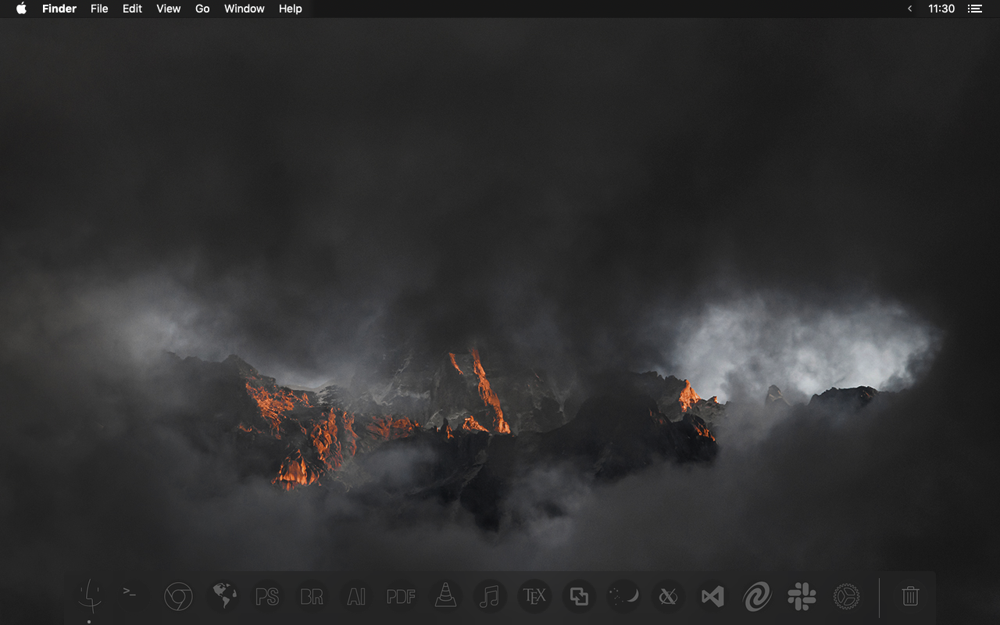
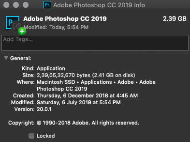

## MINIMALIST MONOCHROME MAC ICONS

### Look & Feel
Replace the default mac icons with these minimalist monochrome icons to create a visually elegeant workspace.

These icons are inspired by [www.fadyucf.com](https://www.fadyucf.com/osx-dock-icons). The following documentation is also adapted from the same website.

### INSTALLATION

#### I. DOWNLOAD THE ICON FILES

1. Click on this [link](https://github.com/amanchokshi/minimalist-monochrome-mac-icons/archive/master.zip) to download the icon files.

1. Using the finder, navigate to the downloaded file, and double click it to unzip the file.  This should create a folder called _**minimalist-monochrome-mac-icons-master**_.

1. Open this folder to find an _**icons**_ folder which contains the actual icons which we will use to replace the default mac icons.

#### II. CHANGE A MAC APPLICATION ICON

1. Use Finder to navigate to the Applications folder of your Mac and select the application for which you want to change the icon.

2. Right-click the application and select "Get Info" (or press &#8984I on your keyboard).

3. In the top left corner of the Info panel, you’ll see the app’s icon. From here, drag the new icon file over the original. Drop it when you see the green + bubble on your cursor.

 

Alternately, you can right-click on the new icon file and choose "Copy", or select the file and press &#8984C. Return to the Info panel, highlight the original icon in the top left corner, and press &#8984V to paste it.

 **NOTE**: OS X may ask you for your administrative password; enter it to paste the icon.

4. If the application is already in your Dock, the new icon may not show up until you log out. To fix this, open Terminal (Applications > Utilities > Terminal), type “killall Dock” (without quotes), and press Enter.

 

 **NOTE**: Terminal may look somewhat different for you, and that’s fine.

**PS**: If you have trouble changing a particular icon, or if you simply are not able to change a particular icon, refer to the **ERRORS** section at the bottom of this document.

#### III. REVERT BACK TO ORIGINAL ICON

If, for whatever reason, you decide to switch back to the app’s original icon, you can easily do so.

1. Use Finder to navigate to the Applications folder of your Mac and select the app for which you want to revert the icon.

2. Right-click the application and select "Get Info" (or press &#8984I on your keyboard).

3. In the top left corner of the Info panel, you’ll see the app’s icon. Click on it to highlight it.

4. Press Backspace. The app’s icon should be restored to its original state.

  **NOTE**: OS X may ask you for your administrative password; enter it to reset the icon.

#### IV. CHANGE THE FINDER DOCK ICON

1. From the OS X Finder, hit Command+Shift+G to bring up Go To Folder and enter the following path:

 */System/Library/CoreServices/Dock.app/Contents/Resources/*

 2. Locate the file named “finder.png” and “finder@2x.png” and make a copy of these to the Desktop or somewhere else, these will serve as a backups.

3. Locate "finder.png" and "finder@2x.png" from the downloaded icons folder. Drag & drop these two files into the  Resources folder, authenticate the change and choose “Replace”

4. Still in the Finder, hit Command+Shift+G again and this time go to the following path:

 */private/var/folders/*

 5. In the Finder search box, type “com.apple.dock.iconcache” and choose ‘folders’ as the search parameter (that is, the current directory and all subdirectories)

 6. Trash the “com.apple.dock.iconcache” when it’s found.

 7. Now launch the Terminal app, found in /Applicaitons/Utilities/, and type the following to refresh the Dock:

 *killall Dock*

 8. The Dock will relaunch and show the new Finder icon.

If you want to revert back to the default Finder Dock icon, simply use the Go To Folder keystroke again, then copy the backups you made of “finder@2x.png” and “finder.png” to the following directory again:

 */System/Library/CoreServices/Dock.app/Contents/Resources/*

Now you just need to trash the icon cache file and relaunch the Dock. You’ll have your shiny smiling Finder happy face icon back as if it was never replaced.

If you’re feeling like customizing things even further, you’ll find the Dock Resources folder has many other icons to change, including the Trash icon and the indicator lights that appear under app icons in the Dock as well. Happy customizing!

#### CHANGE THE TRASH ICON

1. Navigate to Machintosh HD > System > Library > CoreServices > Dock

2. Right click and “Show Package Contents”

3. Click on Contents > Resources

4. Scroll down to find the files “trashempty.png”, “trashempty@2x.png”, etc. Back them up.

5. Replace old icons with new ones, and delete the reflections. They aren’t needed.

6. Open Terminal.app and type “killall Dock” to refresh the dock.

#### CHANGE ALL MAC OS X SYSTEM ICONS

1. Open a new Finder window from the OS X Desktop and hit Command+Shift+G (or go to the “Go” menu and choose “Go To Folder”.

2. Paste in the following complete file system path in Go To Folder:

 */System/Library/CoreServices/CoreTypes.bundle/Contents/Resources/*

3. Choose “Go” and you’ll instantly be brought to the appropriate resources folder containing all system icons for OS X that are found throughout the Mac 

4. The folder is best viewed in “icon” view with a reasonably visible icon size, which perhaps isn’t too surprising considering this the system icon folder.

You’ll find the directory contains tons of “.icns” files, these are the raw icon files for various system icons, including the default folder icons used for Applications, Documents, Desktop, Downloads, Developer, Generic (the default for a new folder), Group, Library, Music, Movies, Pictures, Public, and quite literally every other default
icon, like mounted external drives, network volumes and computers, iPhones, Macs, and just about everything else.

All of the OS X default icons are stored here. You can use the ‘search’ function to break it down by specifics, narrowing down by ‘Folder’ will show you only the default folder icons used on the Mac.

Modifying system icons is generally not recommended, particularly for novice users. If you have any intention on changing a system icon or several of them, do back up the original .icns files first, and preferably, back up the entire Mac beforehand with Time Machine or your backup method of choice. This insures that you can revert things back to normal if you mess something up.

With that said, each system icon .icns file can be modified or changed, either directly by copying over the icns file, using copy and paste much like changing most other icons on the Mac, or even by editing the .icns file directly in Preview or another image editing app.

Regardless of what method you use to edit or change the icons, you will need administrator privileges to save or make any changes to the files stored here, given that this is a /System folder.

Again, don’t make any changes if you don’t know what you’re doing and haven’t backed up the Mac, you can easily mess something up and render things in OS X quite odd looking by misappropriating icons, incorrectly modifying a file, or using an inappropriate size.

#### ERRORS

In many versions of mac OS X, users are prevented from modifying system files. This includes icons of system applications. Apples, System Integrity Protection (SIP) will prevent you from changing system critical files.

To modify the icons for these applications, you will have to temporarily disable System Integrity Protection. It is crucial to remember to re-enable System Integrity Protocol once all your icons have been successfully updated.

1. Click the Apple Symbol in the Menu bar.

2. Click Restart

3. Hold down Command+R to reboot into Recovery Mode.

4. Click Utilities.

5. Select Terminal.

6. Type: __*csrutil disable*__

7. Press Enter on your keyboard.

8. Click the Apple symbol on your menu bar and select Restart.

To re-enable System Integrity Protection, repeat the above steps but type:
__*csrutil enable*__
